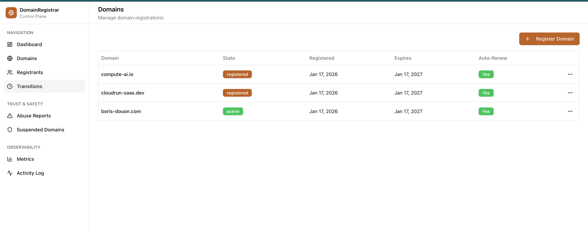
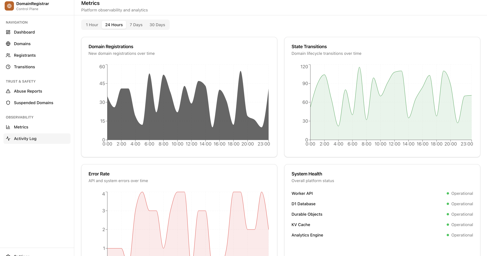
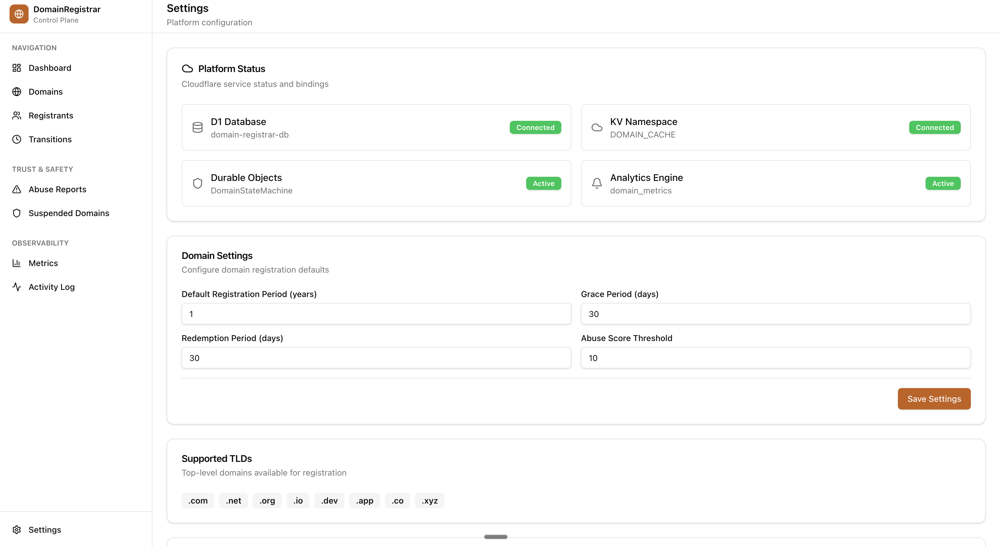
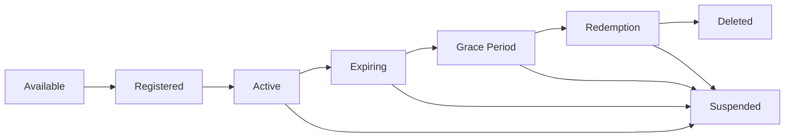

# 🌐 DomainRegistrar Control Plane

<div align="center">


**A production-grade domain lifecycle management platform running entirely at the edge**

[](https://workers.cloudflare.com/)
[](https://astro.build/)
[](https://react.dev/)
[](https://www.typescriptlang.org/)
[](https://tailwindcss.com/)

[Live Demo](https://domain-registrar-panel.douon2010.workers.dev) · [Documentation](docs/project-overview.md) · [Report Bug](https://github.com/borisdouon/domain-registrar-panel/issues)

**🌐 Live URLs:**
- **Main Application**: https://domain-registrar-panel.douon2010.workers.dev
- **Cloudflare Worker**: https://domain-registrar-panel.douon2010.workers.dev
- **Durable Object Worker**: https://domain-state-worker.douon2010.workers.dev

</div>

---

## 📋 Table of Contents

- [Overview](#-overview)
- [Features](#-features)
- [Screenshots](#-screenshots)
- [Tech Stack](#-tech-stack)
- [Architecture](#-architecture)
- [Getting Started](#-getting-started)
- [Deployment](#-deployment)
- [API Documentation](#-api-documentation)
- [Author](#-author)
- [License](#-license)

---

## 🎯 Overview

DomainRegistrar Control Plane is a **registrar-grade domain lifecycle management platform** built entirely on Cloudflare's edge infrastructure. It demonstrates how complex, regulated systems can run serverlessly at the edge with near-zero latency globally.

This platform manages the complete lifecycle of internet domains — from registration to expiration — while enforcing compliance, security, auditability, and performance at global scale.

## Overview

DomainRegistrar Control Plane is a cloud-native platform designed to manage the complete lifecycle of internet domains — from registration to expiration — while enforcing compliance, security, auditability, and performance at global scale.

## ✨ Features

### Domain Lifecycle Management
- ✅ **Full State Machine** - Complete domain lifecycle from Available → Registered → Active → Expiring → Grace Period → Redemption → Deleted
- ✅ **State Validation** - Durable Objects enforce valid state transitions
- ✅ **Automatic Transitions** - Time-based state changes (expiration, grace period)
- ✅ **Manual Controls** - Suspend, lock, unlock, renew domains

### Registrant Management
- ✅ **Email Verification** - Automated verification emails via MailChannels
- ✅ **Contact Validation** - WHOIS-compliant registrant data
- ✅ **Multi-Registrant** - Support for multiple domain owners
- ✅ **Verification Status** - Track verified vs unverified registrants

### Observability & Compliance
- ✅ **Real-Time Metrics** - Cloudflare Analytics Engine integration
- ✅ **Audit Trail** - Complete transition history
- ✅ **Abuse Reporting** - Trust & safety workflows
- ✅ **Activity Logs** - Comprehensive event logging

### Enterprise UI
- ✅ **Modern Dashboard** - Built with shadcn/ui components
- ✅ **Real-Time Updates** - Live data from edge
- ✅ **Responsive Design** - Works on all devices
- ✅ **Dark Mode Ready** - Professional appearance

### Edge-Native Architecture
- ✅ **Global Distribution** - Runs on Cloudflare's 300+ edge locations
- ✅ **Near-Zero Latency** - Sub-50ms response times worldwide
- ✅ **Serverless** - No servers to manage
- ✅ **Auto-Scaling** - Handles any load automatically

---

## 📸 Screenshots

### Dashboard Overview

*Real-time domain metrics and lifecycle state distribution*

### Domain Management

*Complete domain registry with state tracking and actions*

### Registrant Management

*Registrant accounts with email verification status*

### Metrics & Analytics

*Real-time observability with Cloudflare Analytics Engine*

---

## 🛠 Tech Stack

### Frontend
- **[Astro](https://astro.build/)** - Server-side rendering at the edge
- **[React](https://react.dev/)** - Interactive UI components
- **[TailwindCSS](https://tailwindcss.com/)** - Utility-first styling
- **[shadcn/ui](https://ui.shadcn.com/)** - High-quality component library
- **[Recharts](https://recharts.org/)** - Data visualization

### Backend & Infrastructure
- **[Cloudflare Workers](https://workers.cloudflare.com/)** - Serverless edge compute
- **[Cloudflare D1](https://developers.cloudflare.com/d1/)** - Serverless SQL database
- **[Cloudflare Durable Objects](https://developers.cloudflare.com/durable-objects/)** - Distributed state machines
- **[Cloudflare KV](https://developers.cloudflare.com/kv/)** - Edge key-value storage
- **[Cloudflare Analytics Engine](https://developers.cloudflare.com/analytics/analytics-engine/)** - Real-time metrics
- **[MailChannels](https://www.mailchannels.com/)** - Email delivery (free for Workers)

### Development
- **[TypeScript](https://www.typescriptlang.org/)** - Type-safe development
- **[Wrangler](https://developers.cloudflare.com/workers/wrangler/)** - Cloudflare CLI
- **[Vite](https://vitejs.dev/)** - Fast build tooling

## Domain Lifecycle States

```
Available → Registered → Active → Expiring → GracePeriod → Redemption → Deleted
                ↓           ↓          ↓           ↓            ↓
            Suspended ←─────┴──────────┴───────────┴────────────┘
```

## Project Structure

```
src/
├── components/
│   ├── ui/              # shadcn/ui components
│   ├── dashboard/       # Dashboard components
│   ├── domains/         # Domain management components
│   └── metrics/         # Observability components
├── db/
│   └── schema.sql       # D1 database schema
├── layouts/
│   └── Layout.astro     # Base layout
├── lib/
│   ├── db.ts            # Database utilities
│   └── utils.ts         # Utility functions
├── pages/
│   ├── api/             # API routes
│   ├── index.astro      # Dashboard
│   ├── domains.astro    # Domain management
│   └── metrics.astro    # Observability
├── types/
│   ├── domain.ts        # Domain types
│   └── env.d.ts         # Cloudflare env types
└── workers/
    └── domain-state-machine.ts  # Durable Object
```

## Commands

| Command | Action |
|:--------|:-------|
| `npm install` | Install dependencies |
| `npm run dev` | Start local dev server at `localhost:4321` |
| `npm run build` | Build for production |
| `npx wrangler d1 execute domain-registrar-db --local --file=src/db/schema.sql` | Run D1 migrations locally |
| `npx wrangler d1 execute domain-registrar-db --remote --file=src/db/schema.sql` | Run D1 migrations in production |
| `npx wrangler deploy` | Deploy to Cloudflare |

## API Endpoints

| Endpoint | Method | Description |
|:---------|:-------|:------------|
| `/api/domains` | GET | List all domains |
| `/api/domains` | POST | Register a new domain |
| `/api/domains/[id]/transition` | POST | Transition domain state |
| `/api/metrics` | GET | Get platform metrics |

## Cloudflare Bindings

- **DB**: D1 Database for domain records
- **DOMAIN_CACHE**: KV namespace for fast lookups
- **DOMAIN_STATE**: Durable Object for state machine coordination
- **METRICS**: Analytics Engine for observability

## 🏗 Architecture

### Domain Lifecycle State Machine



### System Components

1. **Astro Frontend** - Server-side rendered at the edge
2. **Cloudflare Workers** - API endpoints and business logic
3. **D1 Database** - Persistent storage for domains, registrants, transitions
4. **Durable Objects** - State machine coordination and validation
5. **KV Storage** - Fast lookups and verification tokens
6. **Analytics Engine** - Real-time metrics ingestion

### Data Flow

```
User Request → Cloudflare Edge → Worker → Durable Object (validate)
                                      ↓
                                   D1 Database (persist)
                                      ↓
                                   KV Cache (fast lookup)
                                      ↓
                                Analytics Engine (metrics)
```

---

## 🚀 Getting Started

### Prerequisites

- Node.js 18+ and npm
- Cloudflare account (free tier works)
- Wrangler CLI installed globally

```bash
npm install -g wrangler
wrangler login
```

### Installation

1. **Clone the repository**
```bash
git clone https://github.com/borisdouon/domain-registrar-panel.git
cd domain-registrar-panel
```

2. **Install dependencies**
```bash
npm install
```

3. **Set up D1 database**
```bash
# Create D1 database
wrangler d1 create domain-registrar-db

# Run migrations locally
npx wrangler d1 execute domain-registrar-db --local --file=src/db/schema.sql

# Run migrations in production
npx wrangler d1 execute domain-registrar-db --remote --file=src/db/schema.sql
```

4. **Create KV namespace**
```bash
wrangler kv:namespace create DOMAIN_CACHE
```

5. **Update wrangler.jsonc** with your resource IDs

6. **Start development server**
```bash
npm run dev
```

Visit `http://localhost:4321` to see the application.

---

## 🌍 Deployment

### Deploy to Cloudflare Workers

```bash
# Build and deploy
npm run build
npx wrangler deploy
```

**🚀 Deployed URLs:**
- **Main Application**: https://domain-registrar-panel.douon2010.workers.dev
- **Durable Object Worker**: https://domain-state-worker.douon2010.workers.dev
- **Analytics Dashboard**: https://domain-registrar-panel.douon2010.workers.dev/metrics

### Deploy Durable Object Worker

```bash
cd workers/domain-state
npx wrangler deploy
```

### Environment Setup

1. **Enable Analytics Engine** in Cloudflare Dashboard
2. **Configure Email Routing** (optional, for custom domain emails)
3. **Set up monitoring** and alerts

### Cloudflare Resources

- **Worker**: `domain-registrar-panel`
- **Durable Object**: `domain-state-worker`
- **D1 Database**: `domain-registrar-db`
- **KV Namespace**: `DOMAIN_CACHE`
- **Analytics Engine**: `domain_metrics`

---

## 📚 API Documentation

---

## 👨‍💻 Author

<div align="center">

### **BORIS DOUON**
**Full Stack AI-Software Engineer**

[](https://www.linkedin.com/in/boris-douon/)
[](https://github.com/borisdouon)
[](https://wa.me/2250788233647)
[](mailto:douon2010@gmail.com)

</div>

#### 🎯 Expertise
- **AI & Machine Learning** - LLMs, RAG, Vector Databases, Agentic Systems
- **Full Stack Development** - React, Next.js, Astro, Node.js, Python
- **Cloud & Edge Computing** - Cloudflare Workers, AWS, Serverless Architecture
- **SaaS Development** - End-to-end product development and deployment

#### 💼 Services
- 🚀 **SaaS Development** - From idea to production
- 🤖 **AI Integration** - LLM-powered applications
- ⚡ **Edge Computing** - Cloudflare Workers expertise
- 🎨 **UI/UX Design** - Modern, responsive interfaces
- 📊 **Data Engineering** - Real-time analytics and metrics

#### 🤝 Let's Collaborate!

I'm open to collaborations on innovative SaaS projects. Whether you have an idea or need technical expertise, let's build something amazing together!

**Contact:**
- 📧 **LinkedIn**: [boris-douon](https://www.linkedin.com/in/boris-douon/)
- 💬 **WhatsApp**: +225 07 88 23 36 47
- 📧 **Email**: douon2010@gmail.com
- 🌐 **Portfolio**: (https://boris-douon-portfolio.netlify.app/)
---

## 🌟 Project Highlights

### Why This Project Matters

This project demonstrates:

1. **Edge-First Architecture** - Entire registrar system runs at the edge with <50ms latency globally
2. **Serverless at Scale** - No servers, no ops, infinite scale
3. **Compliance-Ready** - Built with registrar-grade requirements in mind
4. **Production-Grade** - Real-time metrics, audit trails, state machines
5. **Modern Stack** - Latest technologies and best practices

### Technical Achievements

- ✅ **Durable Objects** for distributed state machine coordination
- ✅ **D1 Database** for serverless SQL at the edge
- ✅ **Analytics Engine** for real-time metrics ingestion
- ✅ **Email Verification** with MailChannels (free for Workers)
- ✅ **shadcn/ui** for enterprise-grade UI components
- ✅ **Type-Safe** end-to-end with TypeScript

### Use Cases

- **Domain Registrars** - Complete lifecycle management
- **Hosting Providers** - Domain portfolio management
- **Enterprise IT** - Internal domain tracking
- **Compliance Teams** - Audit and reporting
- **SaaS Platforms** - Multi-tenant domain management

---

## 📄 License

MIT License - feel free to use this project for learning or commercial purposes.

---

## 🙏 Acknowledgments

- **Cloudflare** - For the amazing edge platform
- **Astro Team** - For the best SSR framework
- **shadcn** - For the beautiful UI components
- **Vercel** - For inspiration on modern web development

---

## 📞 Support

If you have questions or need help:

1. 📖 Check the [Documentation](docs/project-overview.md)
2. 🐛 [Open an Issue](https://github.com/borisdouon/domain-registrar-panel/issues)
3. 💬 Contact me on [WhatsApp](https://wa.me/2250788233647)
4. 📧 Email: douon2010@gmail.com

---

<div align="center">

**Built with ❤️ by [BORIS DOUON](https://www.linkedin.com/in/boris-douon/)**

*Powered by Cloudflare Workers · Deployed at the Edge · Globally Distributed*

⭐ Star this repo if you find it useful!

</div>
